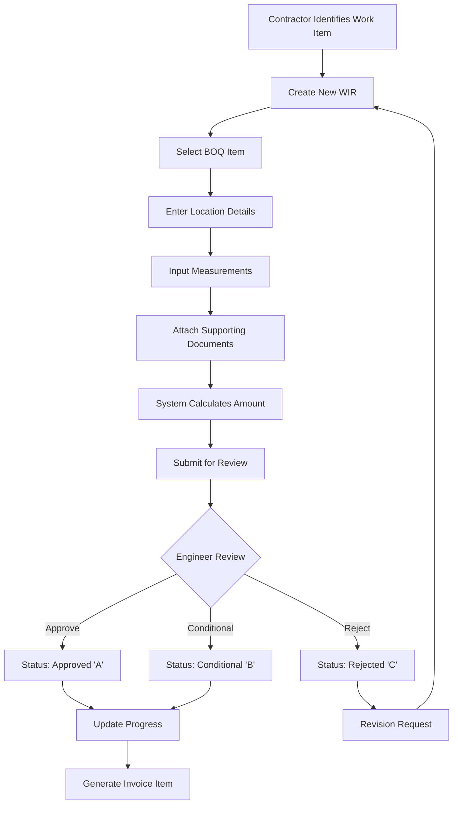
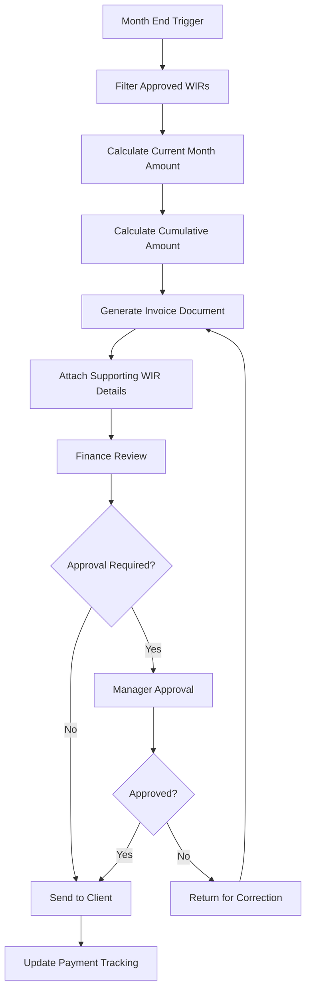

# Work Inspection Request (WIR) Management System
## Business Requirements Document (BRD)

---

**Document Information**
| Field | Value |
|-------|--------|
| Document Title | WIR Management System - Business Requirements Document |
| Document Version | 1.0 |
| Date | January 2025 |
| Project Name | Work Inspection Request Management System |
| Document Status | Final |
| Document Owner | Project Management Office |
| Approved By | Executive Sponsor |

---

## Table of Contents

1. [Executive Summary](#1-executive-summary)
2. [Project Scope](#2-project-scope)
3. [Stakeholders](#3-stakeholders)
4. [Business Requirements](#4-business-requirements)
5. [Functional Requirements by Module](#5-functional-requirements-by-module)
6. [Non-Functional Requirements](#6-non-functional-requirements)
7. [Process Flows and Use Cases](#7-process-flows-and-use-cases)
8. [Constraints and Risks](#8-constraints-and-risks)
9. [Acceptance Criteria and Success Metrics](#9-acceptance-criteria-and-success-metrics)
10. [Appendices](#10-appendices)

---

## 1. Executive Summary

### 1.1 Project Overview

The Work Inspection Request (WIR) Management System is a comprehensive digital solution designed to automate and streamline the management of construction project inspections, progress tracking, and financial calculations. This web-based platform replaces traditional manual processes with an integrated system that handles Bill of Quantities (BOQ) management, work item breakdowns, progress monitoring, and financial reporting.

### 1.2 Business Objectives

**Primary Objectives:**
- **Operational Efficiency**: Reduce administrative processing time by 60% through automation
- **Financial Accuracy**: Eliminate manual calculation errors and improve budget control
- **Real-time Visibility**: Provide instant access to project status and financial metrics
- **Regulatory Compliance**: Ensure comprehensive audit trails and documentation standards
- **Stakeholder Collaboration**: Enable seamless multi-user collaboration with role-based access

**Strategic Alignment:**
- Supports digital transformation initiative
- Enhances project delivery capabilities
- Improves client satisfaction through transparency
- Reduces operational costs and risks

### 1.3 Expected Benefits and Outcomes

**Quantifiable Benefits:**
| Benefit Category | Current State | Target State | Expected Improvement |
|------------------|---------------|--------------|---------------------|
| Processing Time | 40 hours/week | 16 hours/week | 60% reduction |
| Calculation Errors | 15-20 errors/month | 1-2 errors/month | 90% reduction |
| Report Generation | 8 hours/report | 30 minutes/report | 93% reduction |
| Audit Preparation | 2 weeks | 2 days | 85% reduction |
| Data Accessibility | 24-48 hours | Real-time | Immediate access |

**Qualitative Benefits:**
- Enhanced decision-making through real-time data
- Improved stakeholder communication and transparency
- Reduced risk of project delays due to administrative bottlenecks
- Better resource allocation and project planning
- Increased client confidence and satisfaction

**ROI Projections:**
- **Year 1**: Break-even through operational savings
- **Year 2**: 150% ROI through efficiency gains and error reduction
- **Year 3**: 200% ROI through scalability and additional project capacity

---

## 2. Project Scope

### 2.1 In-Scope Items

**Core System Modules:**
1. **User Management and Authentication**
   - Role-based access control system
   - User profile management
   - Authentication and authorization

2. **Bill of Quantities (BOQ) Management**
   - Hierarchical BOQ structure management
   - Multi-language support (English/Arabic)
   - Unit rate and quantity tracking

3. **Work Inspection Request (WIR) Processing**
   - WIR creation, submission, and approval workflow
   - Automatic calculation engine
   - Status tracking and notifications

4. **Progress Tracking and Monitoring**
   - Real-time progress visualization
   - Milestone tracking
   - Performance dashboards

5. **Financial Management**
   - Automated invoice generation
   - Budget variance analysis
   - Financial reporting and analytics

6. **Staff Management**
   - Contractor and engineer profiles
   - Assignment tracking
   - Performance metrics

7. **Document and Attachment Management**
   - File upload and storage
   - Version control
   - Security and access control

8. **Audit and Compliance**
   - Comprehensive activity logging
   - Audit trail maintenance
   - Compliance reporting

**Integration Capabilities:**
- Database integration with Supabase
- Real-time synchronization
- Export capabilities (PDF, Excel, CSV)
- Mobile-responsive interface

### 2.2 Out-of-Scope Items

**Explicitly Excluded:**
- Integration with external ERP systems (Phase 2)
- Advanced project scheduling features (Phase 2)
- Mobile native applications (Phase 2)
- Multi-currency support (Phase 2)
- Advanced workflow automation beyond current requirements
- Third-party contractor portal integration
- Advanced analytics and AI/ML features
- Integration with CAD/BIM systems

### 2.3 Assumptions and Dependencies

**Key Assumptions:**
- Users have basic computer literacy and web browser access
- Reliable internet connectivity available at all project sites
- Current business processes are well-documented and stable
- Stakeholders are committed to training and change management
- Supabase platform will continue to provide required services

**Critical Dependencies:**
- **Technical Dependencies:**
  - Supabase database and authentication services
  - Modern web browser compatibility
  - Secure SSL certificates and hosting infrastructure

- **Business Dependencies:**
  - Stakeholder availability for requirements validation
  - Timely provision of test data and scenarios
  - User training and change management support
  - Business process documentation and approval

- **External Dependencies:**
  - Internet service provider reliability
  - Third-party service availability (Supabase)
  - Regulatory compliance requirements remain stable

---

## 3. Stakeholders

### 3.1 Primary Stakeholders

| Stakeholder Group | Key Representatives | Primary Interests | Influence Level |
|-------------------|-------------------|------------------|----------------|
| **Executive Sponsors** | CEO, COO | ROI, strategic alignment, business growth | High |
| **Project Managers** | Construction PM, IT PM | Project delivery, timeline, budget | High |
| **End Users** | Engineers, Contractors, Supervisors | Usability, efficiency, daily operations | High |
| **IT Department** | IT Manager, System Admin | Technical implementation, security, maintenance | Medium |
| **Finance Department** | CFO, Controllers | Financial accuracy, reporting, compliance | Medium |
| **Quality Assurance** | QA Manager, Auditors | Compliance, audit trails, data integrity | Medium |

### 3.2 Secondary Stakeholders

| Stakeholder Group | Role in Project | Communication Needs |
|-------------------|----------------|-------------------|
| **Legal/Compliance** | Regulatory guidance | Compliance requirements, audit support |
| **HR Department** | User training coordination | Training schedules, user adoption |
| **External Auditors** | Process validation | Audit trail access, compliance verification |
| **Clients/Customers** | Transparency requirements | Progress reports, financial summaries |
| **Vendors/Suppliers** | Data integration needs | Technical specifications, integration requirements |

### 3.3 Stakeholder Responsibilities

**Business Users:**
- Provide detailed requirements and use cases
- Participate in system testing and validation
- Support change management and training initiatives
- Provide feedback during development phases

**Technical Teams:**
- System design, development, and implementation
- Security configuration and maintenance
- Performance monitoring and optimization
- Technical documentation and support

**Executive Leadership:**
- Strategic guidance and decision-making authority
- Resource allocation and budget approval
- Change management sponsorship
- Success metrics definition and monitoring

---

## 4. Business Requirements

### 4.1 High-Level Business Requirements

#### BR-001: Process Automation and Efficiency
**Requirement:** The system shall automate manual processes to reduce administrative overhead by minimum 60%.
**Business Driver:** Operational efficiency and cost reduction
**Success Criteria:** Measurable reduction in processing time and administrative effort
**Priority:** High

#### BR-002: Financial Accuracy and Control
**Requirement:** The system shall eliminate calculation errors and provide real-time financial visibility.
**Business Driver:** Financial accuracy and budget control
**Success Criteria:** 95% reduction in calculation errors, real-time financial reporting
**Priority:** High

#### BR-003: Regulatory Compliance and Audit Support
**Requirement:** The system shall maintain comprehensive audit trails for all business transactions.
**Business Driver:** Regulatory compliance and audit requirements
**Success Criteria:** Complete audit trail capability, compliance report generation
**Priority:** High

#### BR-004: Stakeholder Collaboration and Communication
**Requirement:** The system shall enable seamless collaboration between all project stakeholders.
**Business Driver:** Improved communication and project coordination
**Success Criteria:** Multi-user concurrent access, role-based permissions
**Priority:** Medium

#### BR-005: Scalability and Growth Support
**Requirement:** The system shall support multiple concurrent projects and growing user base.
**Business Driver:** Business growth and expansion capabilities
**Success Criteria:** System performance maintained with 5x current user load
**Priority:** Medium

### 4.2 Measurable Success Criteria

#### Operational Metrics
| Metric | Current State | Target State | Measurement Method |
|--------|---------------|--------------|-------------------|
| WIR Processing Time | 4 hours average | 30 minutes average | System timestamps |
| Report Generation | 8 hours manual | 5 minutes automated | Time tracking |
| Data Entry Errors | 15-20 per month | 1-2 per month | Error logging |
| User Satisfaction | 60% satisfied | 90% satisfied | User surveys |
| System Uptime | 95% | 99.5% | Monitoring tools |

#### Financial Metrics
| Metric | Baseline | Target | Measurement Period |
|--------|----------|--------|-------------------|
| Administrative Cost Reduction | $0 | 60% reduction | Annual |
| Error-related Costs | Current level | 90% reduction | Quarterly |
| Audit Preparation Costs | Current level | 85% reduction | Annual |
| ROI | 0% | 150% by Year 2 | Annual |

#### Quality Metrics
| Metric | Current State | Target State | Measurement Frequency |
|--------|---------------|--------------|----------------------|
| Data Accuracy | 85% | 99% | Monthly |
| Process Compliance | 70% | 98% | Quarterly |
| Audit Findings | 10-15 per audit | 2-3 per audit | Per audit cycle |

---

## 5. Functional Requirements by Module

### 5.1 User Management Module

#### Module Description
Comprehensive user authentication, authorization, and profile management system supporting role-based access control and secure user operations.

#### Features and Capabilities

**UM-001: User Authentication**
- **Description:** Secure login and authentication system
- **User Roles:** All users
- **Input Requirements:** Username/password credentials
- **Output Requirements:** Authentication token, user session
- **Business Rules:** 
  - Password complexity requirements (minimum 8 characters, alphanumeric)
  - Account lockout after 3 failed attempts
  - Session timeout after 30 minutes of inactivity

**UM-002: Role-Based Access Control**
- **Description:** Hierarchical permission system based on user roles
- **User Roles:** Administrators (assign), All users (consume)
- **Input Requirements:** User role assignment, permission definitions
- **Output Requirements:** Access permissions, feature availability
- **Business Rules:**
  - Five role levels: Admin, Manager, Engineer, Contractor, Viewer
  - Permissions cannot be escalated without administrative approval
  - Role changes require administrative authorization

**UM-003: User Profile Management**
- **Description:** User information maintenance and profile updates
- **User Roles:** All users (own profile), Administrators (all profiles)
- **Input Requirements:** Personal information, contact details, department
- **Output Requirements:** Updated profile data, change notifications
- **Business Rules:**
  - Users can only modify their own profiles
  - Administrators can modify any profile
  - Profile changes are logged for audit purposes

#### Integration Requirements
- Integration with Supabase authentication system
- Real-time session management
- Audit logging for all user activities

### 5.2 BOQ Management Module

#### Module Description
Bill of Quantities management system supporting hierarchical item structures, multi-language descriptions, and financial calculations.

#### Features and Capabilities

**BOQ-001: Hierarchical BOQ Structure**
- **Description:** Multi-level BOQ item organization with parent-child relationships
- **User Roles:** Administrators, Managers (edit), Engineers and Contractors (view)
- **Input Requirements:** BOQ codes, descriptions, quantities, rates
- **Output Requirements:** Structured BOQ hierarchy, calculated totals
- **Business Rules:**
  - Unique BOQ codes required for all items
  - Parent items cannot have direct quantities
  - Child item totals roll up to parent levels

**BOQ-002: Multi-Language Support**
- **Description:** English and Arabic description support for all BOQ items
- **User Roles:** Content administrators (edit), All users (view)
- **Input Requirements:** English and Arabic descriptions
- **Output Requirements:** Localized BOQ displays
- **Business Rules:**
  - English descriptions are mandatory
  - Arabic descriptions are optional but recommended
  - Language switching affects entire interface

**BOQ-003: Financial Calculations**
- **Description:** Automatic calculation of extended amounts and totals
- **User Roles:** System automated, Administrators (verify)
- **Input Requirements:** Quantities, unit rates
- **Output Requirements:** Extended amounts, subtotals, grand totals
- **Business Rules:**
  - Calculations update in real-time
  - All amounts rounded to 2 decimal places
  - Negative quantities or rates not permitted

#### Performance Requirements
- BOQ hierarchy loading within 2 seconds
- Real-time calculation updates
- Support for up to 10,000 BOQ items

### 5.3 WIR Processing Module

#### Module Description
Core Work Inspection Request processing system handling the complete WIR lifecycle from creation through approval and completion.

#### Features and Capabilities

**WIR-001: WIR Creation and Submission**
- **Description:** Comprehensive WIR creation with all required data fields
- **User Roles:** Engineers, Contractors (create), Managers (review)
- **Input Requirements:** 
  - BOQ item selection
  - Location details (manholes, zones, roads)
  - Measurement data (length, diameter)
  - Contractor and engineer assignments
  - Supporting attachments
- **Output Requirements:** 
  - Unique WIR number generation
  - Status tracking initialization
  - Calculation results
- **Business Rules:**
  - WIR numbers auto-generated with date prefix
  - All mandatory fields must be completed
  - Location coordinates validated for accuracy

**WIR-002: Automated Calculations**
- **Description:** Real-time calculation of WIR amounts based on breakdown items
- **User Roles:** System automated, Engineers (validate)
- **Input Requirements:** 
  - Selected breakdown items and percentages
  - Measurement quantities
  - BOQ unit rates
- **Output Requirements:** 
  - Calculated WIR amount
  - Calculation equation display
  - Variance analysis
- **Business Rules:**
  - Formula: Length × Unit Rate × (Breakdown Percentages / 100)
  - Total breakdown percentages cannot exceed 100%
  - Calculations update automatically when inputs change

**WIR-003: Approval Workflow**
- **Description:** Multi-stage approval process with status tracking
- **User Roles:** Engineers (approve/reject), Managers (oversight)
- **Input Requirements:** 
  - Review comments
  - Approval/rejection decision
  - Conditional approval conditions
- **Output Requirements:** 
  - Updated WIR status
  - Notification to stakeholders
  - Audit trail entry
- **Business Rules:**
  - Three approval outcomes: Approved (A), Conditional (B), Rejected (C)
  - Rejected WIRs can be revised and resubmitted
  - Approved WIRs cannot be modified without revision process

**WIR-004: Revision Management**
- **Description:** Version control for WIR modifications and resubmissions
- **User Roles:** Original submitters (revise), Approvers (review)
- **Input Requirements:** 
  - Original WIR reference
  - Revision justification
  - Updated information
- **Output Requirements:** 
  - New revision with incremented version number
  - Link to original WIR
  - Revision history tracking
- **Business Rules:**
  - Revisions inherit original WIR number with suffix
  - Original WIR status updated to "Superseded"
  - Revision approval resets workflow

#### Integration Requirements
- Real-time integration with BOQ module for rate lookups
- Attachment management system integration
- Notification system for status updates
- Audit logging for all WIR activities

### 5.4 Progress Tracking Module

#### Module Description
Comprehensive progress monitoring system providing real-time visibility into project completion status, financial performance, and milestone tracking.

#### Features and Capabilities

**PT-001: Real-Time Progress Visualization**
- **Description:** Dynamic dashboards showing completion percentages and trends
- **User Roles:** All users (view), Managers (analyze)
- **Input Requirements:** WIR completion data, BOQ targets
- **Output Requirements:** Progress charts, completion percentages, trend analysis
- **Business Rules:**
  - Progress calculated as (Completed Quantity / Total BOQ Quantity) × 100
  - Progress capped at 100% per BOQ item
  - Updates reflect only approved WIRs

**PT-002: Financial Performance Monitoring**
- **Description:** Budget vs. actual analysis and variance reporting
- **User Roles:** Managers, Finance users (view), Administrators (configure)
- **Input Requirements:** Budget allocations, actual expenditures, approved WIR amounts
- **Output Requirements:** Variance reports, budget utilization charts, forecast analysis
- **Business Rules:**
  - Variances calculated as (Actual - Budget) / Budget × 100
  - Negative variances indicate under-budget performance
  - Forecasts based on current completion rates

**PT-003: Milestone and Timeline Tracking**
- **Description:** Key milestone monitoring with schedule adherence analysis
- **User Roles:** Project managers (set/modify), All users (view)
- **Input Requirements:** Milestone definitions, target dates, completion criteria
- **Output Requirements:** Milestone status, schedule variance, critical path analysis
- **Business Rules:**
  - Milestones linked to BOQ completion percentages
  - Schedule variances calculated in working days
  - Critical path automatically updated based on progress

#### Performance Requirements
- Dashboard loading within 3 seconds
- Real-time data refresh every 30 seconds
- Support for concurrent multi-user access

### 5.5 Financial Management Module

#### Module Description
Comprehensive financial management system handling invoice generation, budget tracking, and financial reporting with integrated calculations.

#### Features and Capabilities

**FM-001: Automated Invoice Generation**
- **Description:** Monthly invoice creation based on approved WIRs
- **User Roles:** Finance users (generate), Managers (review/approve)
- **Input Requirements:** 
  - Reporting period selection
  - Approved WIRs within period
  - Client information and billing details
- **Output Requirements:** 
  - Formatted invoices (PDF)
  - Supporting documentation
  - Payment tracking records
- **Business Rules:**
  - Invoices include only WIRs with status "A" or "B"
  - Current period and cumulative amounts displayed
  - Invoice numbers auto-generated sequentially

**FM-002: Budget Variance Analysis**
- **Description:** Detailed analysis of budget performance against actual costs
- **User Roles:** Finance users, Managers (analyze), Executives (review)
- **Input Requirements:** 
  - Budget allocations by BOQ item
  - Actual expenditures from approved WIRs
  - Forecast data and projections
- **Output Requirements:** 
  - Variance reports by category
  - Trend analysis and projections
  - Exception reporting for significant variances
- **Business Rules:**
  - Variances exceeding ±10% flagged for review
  - Monthly variance analysis required
  - Forecast accuracy tracked and reported

**FM-003: Financial Reporting and Analytics**
- **Description:** Comprehensive financial reporting suite with export capabilities
- **User Roles:** Finance users (generate), Executives (review)
- **Input Requirements:** 
  - Reporting period and parameters
  - Data aggregation preferences
  - Export format selection
- **Output Requirements:** 
  - Standard financial reports
  - Custom analytics dashboards
  - Export files (PDF, Excel, CSV)
- **Business Rules:**
  - Reports generated from approved data only
  - Historical data retained for comparison
  - Access restricted based on user roles

### 5.6 Staff Management Module

#### Module Description
Comprehensive staff information management covering contractors, engineers, and project team members with assignment tracking and performance monitoring.

#### Features and Capabilities

**SM-001: Contractor Profile Management**
- **Description:** Complete contractor information and project assignment tracking
- **User Roles:** Administrators (manage), Managers (assign), All users (view)
- **Input Requirements:** 
  - Company information and contact details
  - Certification and qualification data
  - Project assignment history
- **Output Requirements:** 
  - Contractor profiles and directories
  - Assignment reports and workload analysis
  - Performance tracking metrics
- **Business Rules:**
  - Unique contractor identification required
  - Certification expiry tracking and alerts
  - Historical performance data retained

**SM-002: Engineer Assignment and Tracking**
- **Description:** Engineering staff management with specialization and workload tracking
- **User Roles:** Administrators (manage), Managers (assign)
- **Input Requirements:** 
  - Professional qualifications and certifications
  - Department and specialization details
  - Current project assignments
- **Output Requirements:** 
  - Engineer profiles and availability
  - Workload distribution reports
  - Specialization matrix
- **Business Rules:**
  - Engineers assigned based on specialization match
  - Workload balancing algorithms applied
  - Professional development tracking included

### 5.7 Document Management Module

#### Module Description
Secure document and attachment management system with version control, access permissions, and integration with WIR processes.

#### Features and Capabilities

**DM-001: File Upload and Storage**
- **Description:** Secure file upload with format validation and storage management
- **User Roles:** All users (upload), Administrators (manage storage)
- **Input Requirements:** 
  - Document files (PDF, images, CAD)
  - Document metadata and descriptions
  - Access permission settings
- **Output Requirements:** 
  - Secure file storage and retrieval
  - File metadata and search capabilities
  - Access control enforcement
- **Business Rules:**
  - Maximum file size: 50MB per file
  - Supported formats: PDF, JPG, PNG, DWG, DXF
  - Virus scanning required for all uploads

**DM-002: Version Control and History**
- **Description:** Document versioning with change tracking and historical access
- **User Roles:** Document owners (version), All users (access history)
- **Input Requirements:** 
  - Updated document versions
  - Change descriptions and justifications
  - Approval workflows
- **Output Requirements:** 
  - Version history tracking
  - Change comparison capabilities
  - Previous version access
- **Business Rules:**
  - All versions retained for audit purposes
  - Version numbering automatically managed
  - Change justification required for major revisions

### 5.8 Audit and Compliance Module

#### Module Description
Comprehensive audit trail system ensuring regulatory compliance, activity tracking, and historical data preservation for all system operations.

#### Features and Capabilities

**AC-001: Activity Logging and Audit Trails**
- **Description:** Detailed logging of all user activities and system operations
- **User Roles:** System automated (log), Administrators (review), Auditors (analyze)
- **Input Requirements:** 
  - User actions and system events
  - Timestamp and session information
  - IP addresses and user agents
- **Output Requirements:** 
  - Comprehensive audit logs
  - Search and filter capabilities
  - Export functions for external review
- **Business Rules:**
  - All user actions logged automatically
  - Logs tamper-proof and immutable
  - Retention period: minimum 7 years

**AC-002: Compliance Reporting**
- **Description:** Automated generation of compliance reports for regulatory requirements
- **User Roles:** Compliance officers (generate), Executives (review)
- **Input Requirements:** 
  - Compliance framework requirements
  - Reporting period and scope
  - Specific compliance criteria
- **Output Requirements:** 
  - Formatted compliance reports
  - Exception and violation reports
  - Corrective action tracking
- **Business Rules:**
  - Reports generated monthly and annually
  - All exceptions documented with resolution plans
  - External auditor access provided upon request

---

## 6. Non-Functional Requirements

### 6.1 Performance Requirements

#### System Performance
| Requirement | Target Metric | Measurement Method | Priority |
|-------------|---------------|-------------------|----------|
| **Response Time** | < 2 seconds for page loads | Automated performance testing | High |
| **Database Query Performance** | < 500ms for complex queries | Database monitoring tools | High |
| **File Upload Speed** | < 30 seconds for 50MB files | Network performance testing | Medium |
| **Report Generation** | < 60 seconds for complex reports | End-to-end testing | Medium |
| **Search Performance** | < 1 second for text searches | Search performance metrics | Medium |

#### Scalability Requirements
| Requirement | Target Capacity | Current Baseline | Growth Planning |
|-------------|----------------|-----------------|-----------------|
| **Concurrent Users** | 200 active users | 40 active users | 5x capacity |
| **Data Volume** | 1 million WIRs | 50,000 WIRs | 20x capacity |
| **File Storage** | 1TB total storage | 50GB current | 20x capacity |
| **Database Transactions** | 1000 TPS | 100 TPS | 10x capacity |

### 6.2 Scalability Requirements

#### Horizontal Scaling Capabilities
- **Application Tier**: Support for load balancer distribution across multiple application instances
- **Database Tier**: Supabase automatic scaling with read replicas
- **Storage Tier**: CDN integration for file delivery and caching
- **Geographic Distribution**: Multi-region deployment capability for global access

#### Capacity Planning
- **User Growth**: System designed to accommodate 500% user growth over 3 years
- **Data Growth**: Database architecture supports 2000% data volume increase
- **Transaction Volume**: Processing capacity for 10x current transaction rates
- **Storage Expansion**: Automatic scaling for file storage requirements

### 6.3 Security Requirements

#### Authentication and Authorization
| Security Control | Implementation | Compliance Standard | Validation Method |
|------------------|----------------|-------------------|------------------|
| **Multi-Factor Authentication** | Optional 2FA implementation | Industry best practice | Penetration testing |
| **Password Policy** | Complex passwords, regular rotation | ISO 27001 | Policy compliance audit |
| **Session Management** | Secure session handling, timeout controls | OWASP guidelines | Security testing |
| **Role-Based Access** | Granular permission system | Principle of least privilege | Access review audits |

#### Data Protection
| Protection Method | Implementation | Standard | Verification |
|-------------------|----------------|----------|-------------|
| **Encryption at Rest** | AES-256 database encryption | Industry standard | Encryption audit |
| **Encryption in Transit** | TLS 1.3 for all communications | Security best practice | SSL certificate validation |
| **Data Backup** | Automated daily backups with 30-day retention | Business continuity | Restore testing |
| **Data Masking** | Sensitive data protection in non-production | Privacy protection | Data privacy audit |

#### Network Security
- **Firewall Protection**: Web application firewall (WAF) implementation
- **DDoS Protection**: Rate limiting and traffic analysis
- **IP Whitelisting**: Network-based access restrictions for sensitive operations
- **VPN Access**: Secure remote access for administrative functions

### 6.4 Usability Requirements

#### User Experience Standards
| Usability Factor | Target Metric | Measurement Method | Acceptance Criteria |
|------------------|---------------|-------------------|-------------------|
| **Learnability** | 90% task completion for new users within 1 hour | User testing sessions | User can complete basic WIR creation |
| **Efficiency** | 50% reduction in task completion time vs. current process | Time-motion studies | Measurable productivity improvement |
| **Error Prevention** | < 5% user-induced errors | Error logging and analysis | Form validation and user guidance |
| **Satisfaction** | 4.5/5 user satisfaction rating | User surveys and feedback | Quarterly satisfaction assessment |

#### Accessibility Standards
- **WCAG 2.1 AA Compliance**: Web Content Accessibility Guidelines adherence
- **Keyboard Navigation**: Full functionality without mouse dependency
- **Screen Reader Support**: Compatible with assistive technologies
- **Color Contrast**: Minimum 4.5:1 contrast ratio for text elements
- **Responsive Design**: Optimal experience across device types and screen sizes

#### Multi-Language Support
- **Bidirectional Text**: Support for Arabic right-to-left text rendering
- **Unicode Support**: Full UTF-8 character set compatibility
- **Localization**: Date, number, and currency formatting per locale
- **Content Management**: Easy translation and content updates

### 6.5 Reliability Requirements

#### System Availability
| Reliability Metric | Target | Current State | Improvement Plan |
|--------------------|--------|---------------|------------------|
| **System Uptime** | 99.5% availability (43.8 hours downtime/year) | 95% current | Infrastructure upgrade |
| **Planned Downtime** | < 4 hours/month for maintenance | 8 hours/month current | Automated deployment |
| **Recovery Time** | < 30 minutes RTO (Recovery Time Objective) | 2 hours current | Automated failover |
| **Data Recovery** | < 15 minutes RPO (Recovery Point Objective) | 1 hour current | Enhanced backup strategy |

#### Fault Tolerance
- **Graceful Degradation**: System continues operating with reduced functionality during partial outages
- **Error Handling**: Comprehensive error catching and user-friendly error messages
- **Data Integrity**: Transaction rollback and consistency checks
- **Monitoring and Alerting**: Proactive system health monitoring with automated alerts

### 6.6 Compliance Requirements

#### Regulatory Compliance
| Compliance Area | Requirement | Implementation | Validation |
|-----------------|-------------|----------------|------------|
| **Data Privacy** | Personal data protection | Privacy by design principles | Privacy impact assessment |
| **Financial Reporting** | Accurate financial data | Automated calculation validation | Financial audit procedures |
| **Audit Requirements** | Complete audit trail | Immutable logging system | External audit certification |
| **Industry Standards** | Construction industry compliance | Best practice implementation | Industry compliance review |

#### Documentation Standards
- **System Documentation**: Complete technical and user documentation
- **Process Documentation**: Detailed business process documentation
- **Compliance Documentation**: Regulatory compliance evidence and reports
- **Change Documentation**: Complete change management and approval records

---

## 7. Process Flows and Use Cases

### 7.1 Core Business Process Flows

#### 7.1.1 WIR Creation and Approval Process



**Process Description:**
This flow represents the complete lifecycle of a Work Inspection Request from initial creation through final approval and financial processing.

**Key Decision Points:**
1. **BOQ Item Selection**: Ensures proper categorization and rate application
2. **Engineer Review**: Quality control and technical validation
3. **Approval Decision**: Determines financial and progress implications

**Business Rules:**
- Only approved (A) and conditional (B) WIRs contribute to progress calculations
- Rejected (C) WIRs can be revised and resubmitted
- All status changes trigger automated notifications

#### 7.1.2 Monthly Invoice Generation Process



**Process Description:**
Automated monthly invoice generation based on approved WIRs with built-in validation and approval workflow.

**Key Calculations:**
- Current period amount: Sum of WIRs received in target month
- Cumulative amount: Total of all previous approved WIRs
- Supporting documentation: Detailed WIR breakdown with calculations

### 7.2 Detailed Use Cases

#### Use Case 1: Engineer Creates and Submits WIR

**Use Case ID**: UC-001
**Actor**: Site Engineer
**Preconditions**: 
- User authenticated with Engineer role
- BOQ items exist in system
- Work inspection completed on site

**Main Flow:**
1. Engineer navigates to WIR creation page
2. System displays WIR form with mandatory fields
3. Engineer selects applicable BOQ item from dropdown
4. System auto-populates item description and unit rate
5. Engineer enters location details:
   - Region, zone, road information
   - Manhole from/to coordinates
   - Line number and specifications
6. Engineer inputs measurement data:
   - Length of line (meters)
   - Diameter of line (millimeters)
7. Engineer selects applicable breakdown items
8. System automatically calculates WIR amount using formula:
   `Amount = Length × Unit Rate × (Sum of Breakdown Percentages / 100)`
9. Engineer uploads supporting documentation
10. Engineer reviews calculated amount and submits WIR
11. System generates unique WIR number and sends notification

**Alternative Flows:**
- **A1**: BOQ item not available - Engineer requests new BOQ item creation
- **A2**: Calculation validation fails - System displays error and prevents submission
- **A3**: Mandatory fields missing - System highlights required fields

**Postconditions:**
- WIR created with "Submitted" status
- Notification sent to reviewing engineer
- Audit log entry created

**Business Value**: Streamlines work documentation and ensures accurate calculations

#### Use Case 2: Manager Reviews Project Progress

**Use Case ID**: UC-002
**Actor**: Project Manager
**Preconditions**:
- User authenticated with Manager role
- WIRs exist in system with various statuses
- BOQ items configured with target quantities

**Main Flow:**
1. Manager accesses progress tracking dashboard
2. System displays real-time progress metrics:
   - Overall project completion percentage
   - Progress by BOQ category
   - Financial performance indicators
3. Manager drills down into specific BOQ items
4. System shows detailed progress breakdown:
   - Target quantity vs. completed quantity
   - Associated WIRs and their status
   - Variance analysis and trends
5. Manager reviews milestone status
6. System highlights items requiring attention:
   - Behind schedule items
   - Budget variance exceeding thresholds
   - Pending approvals requiring escalation
7. Manager generates progress report for stakeholders

**Alternative Flows:**
- **A1**: No progress data available - System displays message and suggests actions
- **A2**: Performance issues detected - System triggers alerts and recommendations

**Postconditions:**
- Progress status reviewed and documented
- Action items identified for follow-up
- Stakeholder reports generated

**Business Value**: Provides real-time visibility enabling proactive project management

#### Use Case 3: Finance User Generates Monthly Invoice

**Use Case ID**: UC-003
**Actor**: Finance User
**Preconditions**:
- User authenticated with Finance role
- Approved WIRs exist for target month
- Client billing information configured

**Main Flow:**
1. Finance user navigates to invoice generation module
2. User selects target month and client
3. System filters WIRs with status "A" or "B" received in selected month
4. System calculates invoice totals:
   - Current month approved amount
   - Previous cumulative amount
   - Grand total amount
5. User reviews WIR details and calculations
6. System generates formatted invoice document (PDF)
7. User attaches supporting documentation
8. System routes invoice for manager approval (if required)
9. Upon approval, system sends invoice to client
10. System updates payment tracking records

**Exception Flows:**
- **E1**: No approved WIRs for month - System displays warning message
- **E2**: Calculation discrepancies detected - System prevents invoice generation
- **E3**: Approval rejected - Invoice returned for correction

**Postconditions**:
- Invoice generated and sent to client
- Payment tracking initiated
- Audit trail updated with invoice details

**Business Value**: Automates invoice generation ensuring accuracy and timeliness

### 7.3 User Journey Mapping

#### Journey 1: New Engineer Onboarding

**Phase 1: Initial Access (Day 1)**
- Receive login credentials and system introduction
- Complete initial training on WIR creation process
- Review system navigation and key features
- Create first WIR under supervision

**Phase 2: Skill Development (Week 1-2)**
- Independent WIR creation with validation support
- Learn advanced features (attachments, revisions)
- Understand approval workflows and status tracking
- Master calculation validation and error resolution

**Phase 3: Proficiency (Month 1)**
- Efficient WIR processing and bulk operations
- Utilize reporting and progress tracking features
- Mentor other users and provide feedback
- Contribute to process improvements

**Success Metrics:**
- 90% task completion accuracy within first week
- 50% reduction in processing time by end of month
- User satisfaction score above 4.0/5.0

#### Journey 2: Monthly Reporting Cycle

**Week 1: Data Collection**
- Review WIR approvals and status updates
- Validate calculations and resolve discrepancies
- Collect supporting documentation and attachments

**Week 2-3: Analysis and Review**
- Generate progress reports and variance analysis
- Review milestone completion and schedule adherence
- Prepare financial summaries and projections

**Week 4: Reporting and Communication**
- Generate and distribute monthly reports
- Conduct stakeholder meetings and presentations
- Document action items and follow-up requirements

**Success Metrics:**
- Reports generated within 2 days of month-end
- 95% accuracy in financial calculations
- Stakeholder satisfaction with report quality and timeliness

---

## 8. Constraints and Risks

### 8.1 Business Constraints

#### Organizational Constraints
| Constraint Type | Description | Impact | Mitigation Strategy |
|----------------|-------------|---------|-------------------|
| **Budget Limitations** | Fixed project budget with no contingency | High | Phased implementation, priority-based delivery |
| **Timeline Constraints** | Go-live date fixed due to contract obligations | High | Agile methodology, parallel development tracks |
| **Resource Availability** | Limited availability of subject matter experts | Medium | Cross-training, documentation, knowledge transfer |
| **Change Management** | Resistance to process changes from existing users | Medium | Training programs, user involvement, gradual rollout |

#### Regulatory Constraints
| Constraint | Requirement | Compliance Deadline | Risk Level |
|------------|-------------|-------------------|------------|
| **Data Privacy** | Personal data protection compliance | Immediate | High |
| **Financial Auditing** | Audit trail requirements | Quarterly reviews | High |
| **Industry Standards** | Construction industry best practices | Ongoing | Medium |
| **Environmental Compliance** | Digital documentation requirements | Annual reporting | Low |

### 8.2 Technical Constraints

#### Technology Platform Constraints
| Constraint Area | Limitation | Business Impact | Workaround |
|----------------|------------|-----------------|------------|
| **Browser Compatibility** | Modern browsers only (IE not supported) | User access limitations | Browser upgrade requirements |
| **Mobile Access** | Responsive web only (no native app) | Field access limitations | Mobile browser optimization |
| **Integration Capabilities** | Limited to Supabase ecosystem | External system integration challenges | API development for future needs |
| **Customization Limits** | Standard Supabase features only | Limited custom functionality | Future platform evaluation |

#### Performance Constraints
| Performance Area | Limitation | Threshold | Monitoring Method |
|------------------|------------|-----------|------------------|
| **Concurrent Users** | Maximum 200 simultaneous users | Performance degradation | Real-time monitoring |
| **File Size Limits** | 50MB maximum per file upload | User workflow impact | File compression guidelines |
| **Database Size** | Supabase plan limitations | Storage cost implications | Data archiving strategy |
| **Network Bandwidth** | Dependent on user internet connectivity | Rural site access issues | Offline capability requirements |

### 8.3 Risk Assessment and Mitigation

#### High-Priority Risks

**Risk 1: Data Migration and Integrity**
- **Description**: Potential data loss or corruption during migration from legacy systems
- **Probability**: Medium (40%)
- **Impact**: Critical - Business continuity threat
- **Mitigation Strategies**:
  - Comprehensive data backup before migration
  - Parallel system operation during transition period
  - Automated data validation and reconciliation tools
  - Rollback procedures and recovery plans
- **Contingency Plan**: Manual data entry capabilities and extended parallel operation

**Risk 2: User Adoption Resistance**
- **Description**: Low user acceptance leading to continued use of legacy processes
- **Probability**: High (60%)
- **Impact**: Major - ROI and efficiency goals not achieved
- **Mitigation Strategies**:
  - Extensive user involvement in design and testing
  - Comprehensive training programs and user support
  - Gradual rollout with pilot user groups
  - Change management activities and executive sponsorship
- **Contingency Plan**: Extended training period and additional support resources

**Risk 3: Performance and Scalability Issues**
- **Description**: System performance degradation under production loads
- **Probability**: Medium (30%)
- **Impact**: Major - User productivity and satisfaction impact
- **Mitigation Strategies**:
  - Comprehensive performance testing before go-live
  - Scalable architecture design with load balancing
  - Monitoring and alerting systems for proactive management
  - Performance optimization and tuning procedures
- **Contingency Plan**: Rapid scaling procedures and performance optimization team

#### Medium-Priority Risks

**Risk 4: Third-Party Service Dependencies**
- **Description**: Supabase service outages or limitations affecting system availability
- **Probability**: Low (20%)
- **Impact**: Major - System unavailability
- **Mitigation Strategies**:
  - Service level agreements with Supabase
  - Monitoring of service status and performance
  - Backup and disaster recovery procedures
  - Alternative service provider evaluation
- **Contingency Plan**: Temporary manual processes during outages

**Risk 5: Security Vulnerabilities**
- **Description**: Data breaches or unauthorized system access
- **Probability**: Low (15%)
- **Impact**: Critical - Legal and compliance implications
- **Mitigation Strategies**:
  - Comprehensive security testing and penetration testing
  - Regular security updates and patch management
  - User training on security best practices
  - Incident response procedures and monitoring
- **Contingency Plan**: Immediate system isolation and forensic investigation

### 8.4 Dependency Management

#### Critical Dependencies
| Dependency | Owner | Impact if Delayed | Mitigation |
|------------|-------|------------------|------------|
| **Supabase Platform Availability** | External Provider | Project failure | Alternative provider research |
| **User Requirements Finalization** | Business Stakeholders | Scope creep, delays | Regular review meetings |
| **Test Data Preparation** | Business Users | Testing delays | Synthetic data generation |
| **User Training Completion** | HR/Training Teams | Adoption delays | Online training alternatives |

#### Success Factors
- **Executive Sponsorship**: Strong leadership support for change management
- **User Engagement**: Active user participation in design and testing
- **Technical Expertise**: Skilled development team with platform experience
- **Project Management**: Structured approach with clear milestones and accountability
- **Communication**: Regular stakeholder communication and feedback incorporation

---

## 9. Acceptance Criteria and Success Metrics

### 9.1 Functional Acceptance Criteria

#### User Management Acceptance Criteria
**AC-UM-001: User Authentication**
- **Given**: Valid user credentials
- **When**: User attempts to log in
- **Then**: System authenticates user and grants appropriate role-based access
- **Acceptance Test**: 100% of valid login attempts succeed within 3 seconds

**AC-UM-002: Role-Based Access Control**
- **Given**: User with specific role logged in
- **When**: User attempts to access system features
- **Then**: System permits access only to authorized features for that role
- **Acceptance Test**: All role permission combinations tested and validated

#### WIR Processing Acceptance Criteria
**AC-WIR-001: WIR Creation and Calculation**
- **Given**: User has Engineer role and valid BOQ items exist
- **When**: User creates WIR with all required data
- **Then**: System generates unique WIR number and calculates amount accurately
- **Acceptance Test**: 100 test WIRs created with verified calculations

**AC-WIR-002: Approval Workflow**
- **Given**: WIR submitted for approval
- **When**: Reviewer provides approval decision
- **Then**: System updates status and triggers appropriate notifications
- **Acceptance Test**: All approval scenarios tested including edge cases

#### Progress Tracking Acceptance Criteria
**AC-PT-001: Real-time Progress Updates**
- **Given**: WIRs approved in the system
- **When**: User views progress dashboard
- **Then**: System displays current progress percentages based on approved quantities
- **Acceptance Test**: Progress calculations verified against manual calculations

### 9.2 Performance Acceptance Criteria

#### Response Time Criteria
| Function | Maximum Response Time | Test Method | Acceptance Threshold |
|----------|----------------------|-------------|-------------------|
| **User Login** | 2 seconds | Load testing with 100 concurrent users | 95% of requests meet criteria |
| **WIR Creation** | 3 seconds | End-to-end testing | 90% of transactions meet criteria |
| **Dashboard Loading** | 3 seconds | Performance monitoring | 95% of page loads meet criteria |
| **Report Generation** | 60 seconds | Complex report testing | 100% of reports complete within time |
| **File Upload** | 30 seconds for 50MB | Network testing | 90% of uploads meet criteria |

#### Scalability Criteria
| Metric | Target Performance | Test Scenario | Acceptance Level |
|--------|-------------------|---------------|------------------|
| **Concurrent Users** | 200 active users | Load testing simulation | No performance degradation |
| **Data Volume** | 1 million WIR records | Database stress testing | Query performance maintained |
| **Transaction Throughput** | 1000 transactions/hour | Peak usage simulation | System stability maintained |

### 9.3 Business Success Metrics

#### Operational Efficiency Metrics
| Success Metric | Baseline | Target | Measurement Period | Owner |
|----------------|----------|--------|-------------------|-------|
| **WIR Processing Time** | 4 hours average | 30 minutes average | Monthly | Operations Manager |
| **Calculation Error Rate** | 15-20 errors/month | 1-2 errors/month | Monthly | Quality Assurance |
| **Report Generation Time** | 8 hours manual | 5 minutes automated | Per report | Finance Manager |
| **User Productivity** | Current level | 60% improvement | Quarterly | Department Heads |

#### Financial Impact Metrics
| Financial Metric | Current State | Year 1 Target | Year 2 Target | Measurement |
|------------------|---------------|---------------|---------------|-------------|
| **Administrative Cost Reduction** | Baseline | 40% reduction | 60% reduction | Annual budget analysis |
| **Error-Related Costs** | Current level | 70% reduction | 90% reduction | Error impact tracking |
| **ROI Achievement** | 0% | 75% | 150% | Financial analysis |
| **Audit Preparation Costs** | Current level | 50% reduction | 85% reduction | Audit cost tracking |

#### Quality and Compliance Metrics
| Quality Metric | Current Performance | Target Performance | Measurement Method |
|----------------|-------------------|-------------------|-------------------|
| **Data Accuracy** | 85% | 99% | Monthly data validation |
| **Process Compliance** | 70% | 98% | Quarterly compliance audit |
| **System Uptime** | 95% | 99.5% | Continuous monitoring |
| **User Satisfaction** | 60% | 90% | Quarterly surveys |

### 9.4 User Acceptance Testing Criteria

#### UAT Scenarios and Success Criteria

**Scenario 1: End-to-End WIR Processing**
- **Test Objective**: Validate complete WIR lifecycle from creation to approval
- **Success Criteria**: 
  - 100% of test scenarios complete without errors
  - All calculations verified for accuracy
  - Status transitions function correctly
  - Notifications delivered appropriately

**Scenario 2: Financial Reporting and Invoice Generation**
- **Test Objective**: Validate financial calculations and invoice generation
- **Success Criteria**:
  - Invoice amounts match approved WIR totals
  - Supporting documentation correctly attached
  - Export functions work for all required formats
  - Historical data accurately included

**Scenario 3: Multi-User Concurrent Operations**
- **Test Objective**: Validate system performance with multiple simultaneous users
- **Success Criteria**:
  - No data corruption with concurrent editing
  - Performance maintained with target user load
  - Security isolation between user sessions
  - Audit trails complete and accurate

#### User Training and Competency Requirements

**Basic User Competency (All Users)**
- Navigate system interface efficiently
- Understand role-based permissions and limitations
- Perform basic data entry and retrieval operations
- Generate standard reports and exports

**Advanced User Competency (Engineers/Managers)**
- Create and modify complex WIRs with calculations
- Understand approval workflows and status management
- Utilize advanced reporting and analytics features
- Troubleshoot common issues and errors

**Administrator Competency (System Administrators)**
- Manage user accounts and role assignments
- Configure system parameters and business rules
- Monitor system performance and resolve issues
- Maintain audit trails and compliance requirements

### 9.5 Go-Live Readiness Criteria

#### Technical Readiness Checklist
- [ ] All functional requirements tested and accepted
- [ ] Performance benchmarks met or exceeded
- [ ] Security testing completed with no critical issues
- [ ] Data migration validated and verified
- [ ] Backup and recovery procedures tested
- [ ] Monitoring and alerting systems operational
- [ ] User training completed with competency validation
- [ ] Documentation complete and accessible

#### Business Readiness Checklist
- [ ] Business stakeholder sign-off received
- [ ] Change management activities completed
- [ ] Support procedures and contact points established
- [ ] Compliance requirements validated
- [ ] Risk mitigation plans activated
- [ ] Communication plan executed
- [ ] Success metrics baseline established
- [ ] Post-implementation support plan activated

---

## 10. Appendices

### Appendix A: Glossary of Terms

#### Business Terms
| Term | Definition |
|------|------------|
| **Bill of Quantities (BOQ)** | Detailed list of materials, parts, and labor required for a construction project with associated quantities and rates |
| **Work Inspection Request (WIR)** | Formal request for inspection and approval of completed work items with associated measurements and calculations |
| **Breakdown Item** | Component parts of a BOQ item with specific percentages used for detailed cost calculations |
| **Unit Rate** | Standard cost per unit of measurement for a specific BOQ item |
| **Progress Percentage** | Calculated completion status based on approved quantities versus total project quantities |
| **Revision WIR** | Updated version of a previously submitted WIR, maintaining link to original submission |
| **Manholes** | Access points in underground utility systems, used as reference points for location tracking |

#### Technical Terms
| Term | Definition |
|------|------------|
| **Role-Based Access Control (RBAC)** | Security model that restricts system access based on user roles and permissions |
| **Row Level Security (RLS)** | Database security feature that controls access to individual rows based on user context |
| **Real-time Synchronization** | Immediate data updates across all system components and user interfaces |
| **Audit Trail** | Chronological record of system activities and user actions for compliance and security |
| **API (Application Programming Interface)** | Set of protocols and tools for building software applications and integrations |
| **CDN (Content Delivery Network)** | Geographically distributed servers for fast content delivery |

#### Status and Result Codes
| Code | Description | Business Impact |
|------|-------------|----------------|
| **Status: Submitted** | WIR created and submitted for review | Pending approval, no financial impact |
| **Status: Under Review** | WIR being evaluated by authorized reviewer | Review in progress |
| **Result: A (Approved)** | WIR fully approved without conditions | Full financial value applied |
| **Result: B (Conditional)** | WIR approved with specific conditions | Financial value applied with conditions |
| **Result: C (Rejected)** | WIR rejected, requires revision | No financial impact, revision needed |

### Appendix B: System Integration Points

#### Database Integration Architecture
```
Application Layer (React/TypeScript)
         ↓
API Layer (Supabase Client)
         ↓
Authentication (Supabase Auth)
         ↓
Database (PostgreSQL with RLS)
         ↓
Storage (Supabase Storage)
```

#### External Integration Requirements
| Integration Type | Purpose | Implementation | Timeline |
|------------------|---------|----------------|----------|
| **Email Notifications** | User notifications and alerts | SMTP integration | Phase 1 |
| **File Storage** | Document and attachment management | Supabase Storage | Phase 1 |
| **Audit Logging** | Compliance and security monitoring | Database triggers | Phase 1 |
| **Export Functions** | Data export to Excel/PDF | Client-side libraries | Phase 1 |
| **ERP Integration** | Financial system integration | API development | Phase 2 |

### Appendix C: Data Migration Strategy

#### Migration Phases
**Phase 1: Data Assessment and Cleansing**
- Inventory existing data sources and formats
- Identify data quality issues and inconsistencies
- Develop data cleansing and transformation rules
- Create data mapping specifications

**Phase 2: Migration Tool Development**
- Build automated migration scripts and tools
- Implement data validation and verification routines
- Create rollback and recovery procedures
- Develop error handling and logging capabilities

**Phase 3: Migration Execution**
- Execute migration in controlled environment
- Validate data integrity and completeness
- Perform reconciliation with source systems
- Document migration results and issues

#### Data Validation Checkpoints
| Validation Type | Method | Acceptance Criteria |
|----------------|--------|-------------------|
| **Record Count Validation** | Automated counting | 100% record migration |
| **Data Integrity Validation** | Checksum verification | 100% data accuracy |
| **Relationship Validation** | Foreign key checks | All relationships intact |
| **Business Rule Validation** | Custom validation scripts | All business rules satisfied |

### Appendix D: Training and Support Plan

#### Training Program Structure

**Tier 1: Basic User Training (4 hours)**
- System overview and navigation
- Basic WIR creation and submission
- Standard reporting and data viewing
- Password management and security

**Tier 2: Advanced User Training (8 hours)**
- Complex WIR creation with calculations
- Approval workflows and status management
- Advanced reporting and analytics
- Troubleshooting and error resolution

**Tier 3: Administrator Training (16 hours)**
- User management and role assignment
- System configuration and customization
- Performance monitoring and optimization
- Security management and compliance

#### Support Model
**Level 1 Support: Help Desk (Response: 4 hours)**
- Basic user questions and navigation help
- Password resets and access issues
- Standard report generation assistance
- Documentation and training material access

**Level 2 Support: Technical Team (Response: 24 hours)**
- Complex technical issues and errors
- Data integrity and calculation problems
- Performance issues and optimization
- Integration and customization support

**Level 3 Support: Development Team (Response: 72 hours)**
- System bugs and defect resolution
- Major performance and scalability issues
- Security incidents and investigations
- System enhancement and modification requests

### Appendix E: Compliance and Audit Framework

#### Regulatory Compliance Matrix
| Compliance Area | Requirement | Implementation | Validation |
|-----------------|-------------|----------------|------------|
| **Data Privacy** | Personal data protection | Role-based access, data encryption | Privacy audit |
| **Financial Accuracy** | Accurate financial calculations | Automated validation, audit trails | Financial audit |
| **Document Retention** | 7-year document retention | Automated archiving, secure storage | Retention audit |
| **Access Control** | Authorized access only | Multi-factor authentication, session management | Security audit |

#### Audit Trail Requirements
**User Activity Logging:**
- All login/logout activities with timestamps
- All data creation, modification, and deletion activities
- All report generation and export activities
- All administrative actions and configuration changes

**Data Change Tracking:**
- Field-level change history for all critical data
- Before/after values for all modifications
- User identification and timestamp for all changes
- Approval history and workflow status changes

**System Activity Monitoring:**
- Performance metrics and system health data
- Error logs and exception handling records
- Security events and access violation attempts
- Integration activities and external system communications

---

**Document Control**
- **Last Updated**: January 2025
- **Next Review Date**: March 2025
- **Distribution List**: Project Stakeholders, Development Team, Business Users
- **Approval Authority**: Project Steering Committee

**Version History**
| Version | Date | Author | Changes |
|---------|------|--------|---------|
| 1.0 | January 2025 | Project Team | Initial comprehensive BRD |

---

*This Business Requirements Document serves as the authoritative source for all functional and non-functional requirements for the WIR Management System. Any changes to these requirements must be approved through the formal change control process.*